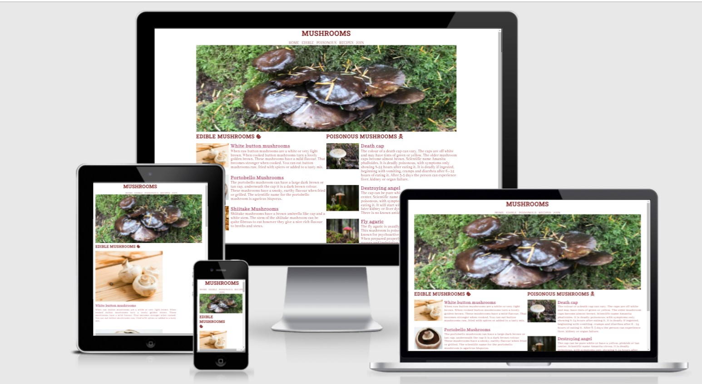

# Mushrooms
The mushroom website show the user different types of mushrooms that are edible or poisonous. It also gives recipes to give the user ideas of what they can do with the different types of mushrooms. 

Users of this website will be able to see what the mushroom looks like and get an idea of tastes and looks. 

## Features
* Navigation
  * At the top center of the page is the name Mushrooms, which is the color of a mushroom.  
  * Under the title also in the center is the navigation bar which takes you to Poisonous and Edible on the index page or recipes and join on a different page. 
  * The navigation font is abhaya libre, it is the same colour as the title but changes when you hover on it. 
