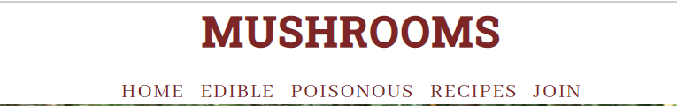
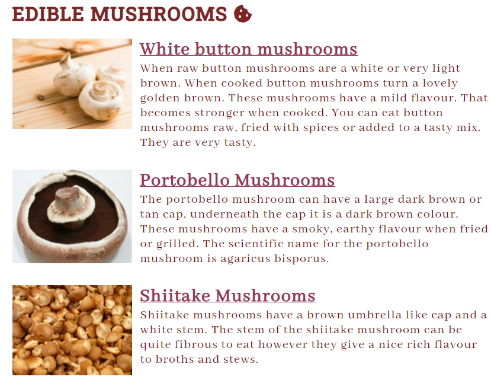
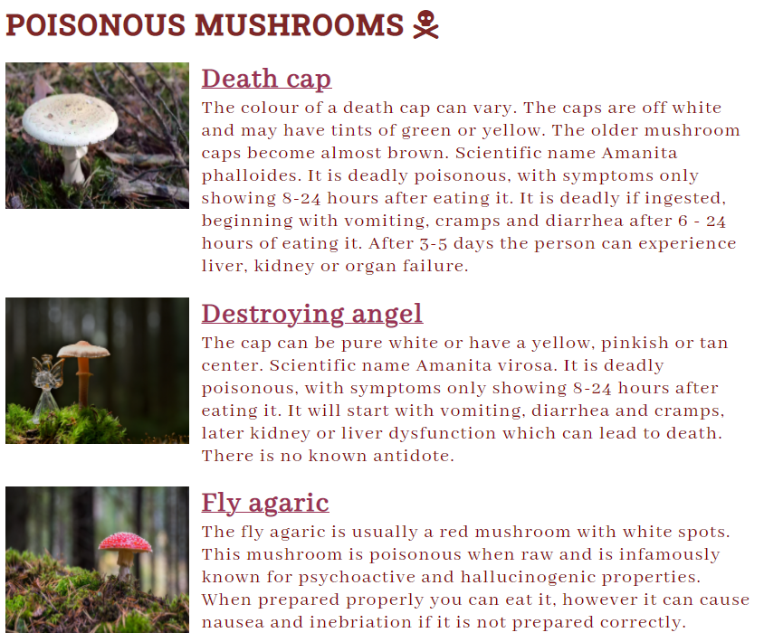
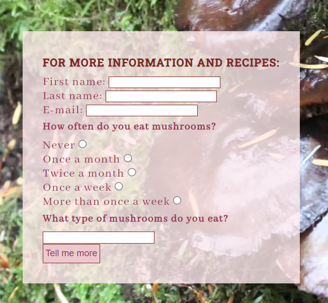
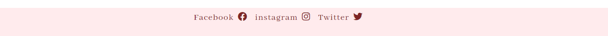
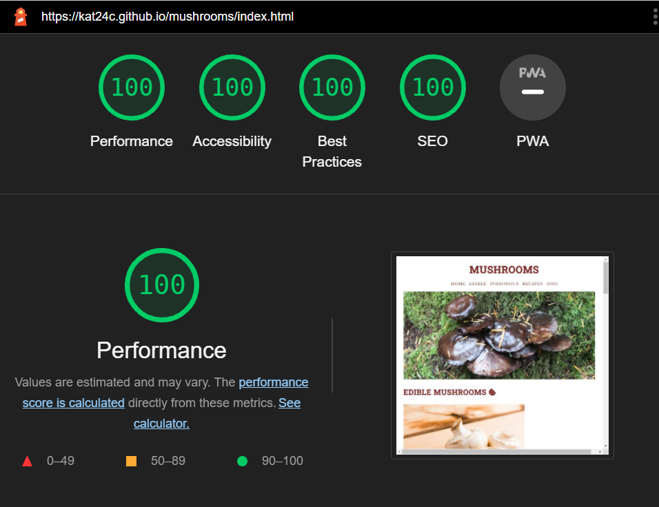

# Mushrooms
The mushroom website show the user different types of mushrooms that are edible or poisonous. It also gives recipes to give the user ideas of what they can do with the different types of mushrooms. It is for users who have an interest in mushrooms. 

Users of this website will be able to see what the mushroom looks like and get an idea of tastes and looks. 

## Features
### * Navigation
  * At the top center of the page is the name Mushrooms, which is the color of a mushroom.  
  * Under the title also in the center is the navigation bar which takes you to Poisonous and Edible on the index page or recipes and join on a different page. 
  * The navigation font is abhaya libre, it is the same colour as the title but changes when you hover on it. 

### * The edible section
   * It gives information about what mushrooms you can eat. 
   * It will help you identify what the mushroom looks like and tastes like. 
   * There is an image of the mushrooms, to help with identification. 

### * The poisonous section
   * Gives information about which mushrooms you should avoid. 
   * It states what will happen if you eat these mushrooms and why you should avoid them. 
   * It tells you what the poisonous mushrooms look like with an image. 

### * The recipe section
  * Gives two recipes that use mushrooms in them. 
  * The recipes contain button mushrooms and portebello mushrooms. 

### * The join section
   * Asks the user if they want to join for more information and recipes. 
   * It asks for user name, email, mushroom preferences and how often they eat mushrooms. 

### * The link section
   * Added a link to facebook, instagram and twitter, using awesome font to add an image. 
   * I used a light pink as the footer background and redish brown for the font. 

## Testing
  * I tested the pages in different browsers including Edge, Chrome and Brave. 
  * I used devtools to confirm that this project is responsive, looks good and functions on different screen sizes. 
  * I confirmed that the form works: it requires entry at every field, the email field will only accept an email, the Tell me more button works. 

### * Bugs
  * While testing I noticed the navigation links on the recipe page and join page did not work. 
  * I fixed this by correcting the code. 
  * On the joining page I had a hyphen by type="email" which I fixed. 
  * My link to the formdrop page I had typed .com instead of .net which has been fixed. 

### * Validation
* CSS
  * No errors were found when running the css code through jigsaw W3C code validator
* HTML sign up form
  * No errors were found when running the html code through validator W3
* HTML recipe section
  * No errors were found when running the html code through validator W3
* HTML index section
  * No errors were found when running the html code through validator W3
* Accessibility
  * By running my project through lighthouse in devtool, I confirmed that the colours and fonts are easy to read and accessible. 

### * Unfixed bugs
  * There were no unfixed bugs. 

## Deployment
  * The site was deployed through Github pages: 
     * Using git add . , git commit -m and git push to upload the content to the github repository. 
     * In the github pages navigate to settings. 
     * From the drop down menu change branch to master. 
     * Once the master branch has been selected, the page will provide a link to the completed website. 
 
 ## Credits
  * The code to make the social media links was adapted from the love running project. 
  * The container code was taken from Spencer Barriball, Mentoor. 
  * Used pictures from font awesome

## Media
  * The first image was taken by me. 
  * The button mushrooms, Fly agaric and Destroying angel images were taken from Pexels. 
  * Death-cap image, Shiitake and Portobello mushroom image were taken from pixabay. 

  * The information was adapted https://www.woodlandtrust.org.uk/, https://specialtyproduce.com, https://en.wikipedia.org, https://mdc.mo.gov/discover-nature/field-guide/destroying-angel, https://www.healthline.com/nutrition/shiitake-mushrooms
